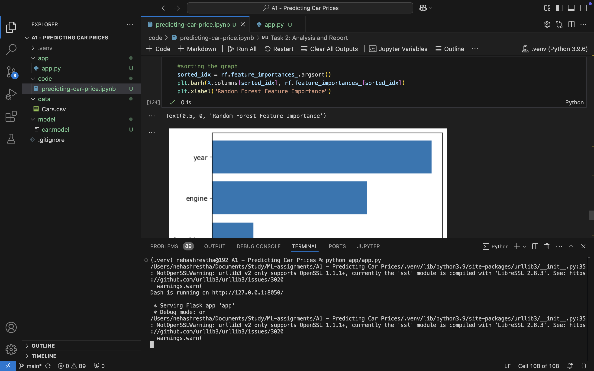
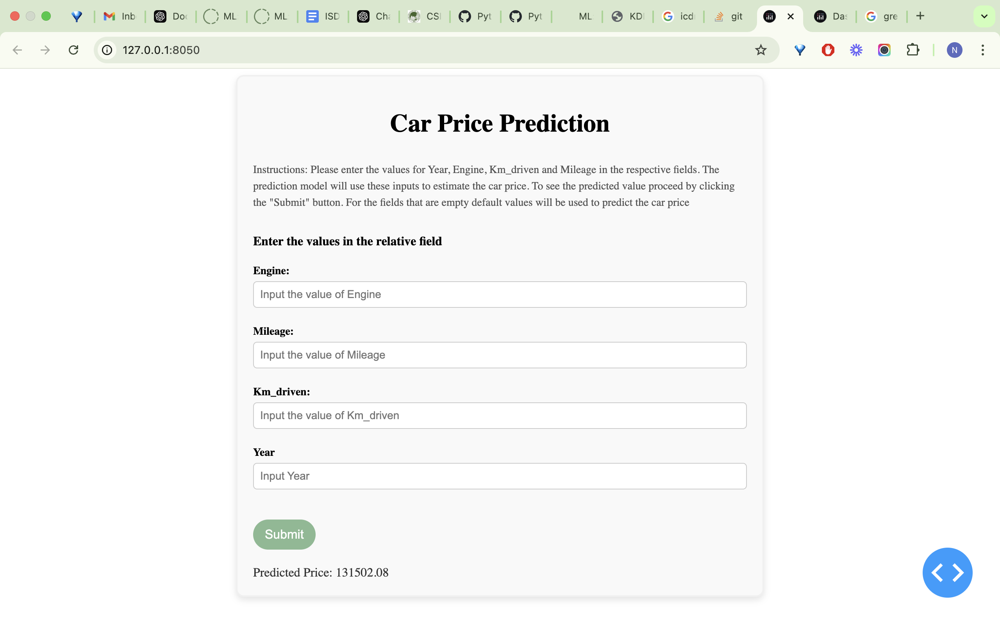
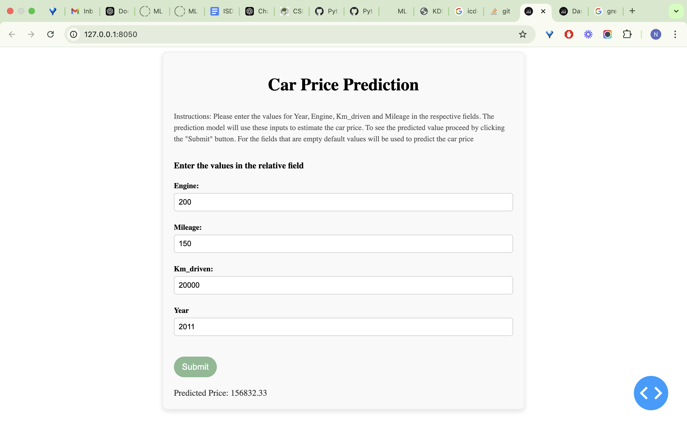

# Assignment: A1-Predicting-Car-Prices

In this assignment I have used 4 features (year, engine, km_driven and mileage) to predict the selling price of cars. For Modelling I have used model such as Linear Regression, SVR, KNeighbors Regressor, Decision Tree Regressor and Random Forest Regressor. Dash-based frontend has been developed to provide an interactive user interface.

The file can be runned locally following the below steps:
1. After clonning the repository navigate to the project directory
2. Activate the virtual environment 
3. Install dependencies 
4. Run the dash application using:
```
python app/app.py
```



Screenshot 1: app.py running in vscode terminal



Screenshot 2: prediction with default values



Screenshot 3: prediction with user assigned values